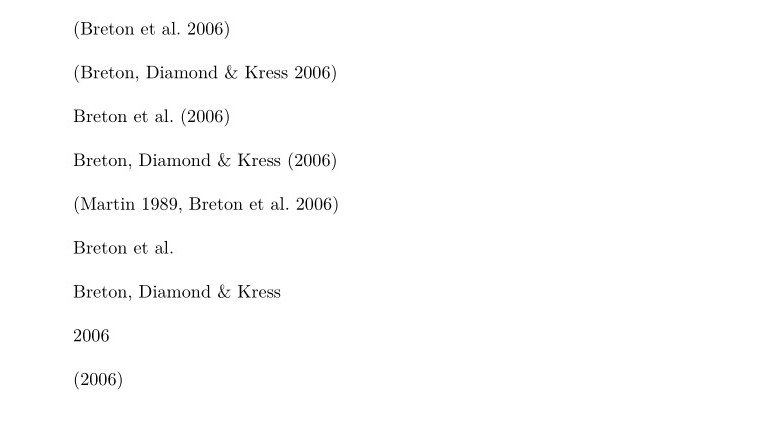

# Victorian Road Fatalities Analysis 
 > Group project for "Statistical Thinking for Data Science" @ UTS, Spring 2021

## Outline
<!-- omit in toc -->
  - [Outline](#outline)
  - [Project Information](#project-information)
  - [Repo Navigations](#repo-navigations)
  - [`.Rmd` files dictionary](#rmd-files-dictionary)
  - [In-text Citation and References](#in-text-citation-and-references)
  - [Others](#others)

---

## 📌 Project Information

### Part A (Proposal)
**Length:** 750-1000 words (not including code samples in appendix)

**Due Date:** 11:59pm Sunday 5th September

### Part B (Report)

**Length:** 5000 words (not including code which can be included in an appendix)
Group Assessment

**Due Date:** 
* **Presentation:** Monday 13th September during class 
* **Report:** 11.59pm Sunday 3rd October

---

## 📁 Repo Navigations

The `data` folder contains all datasets available for analyis in the report. It contains:
* **ACCIDENT:** Datasets were made available from the [Traffic Accident Database System by Victoria Roads](https://vicroadsopendatastorehouse.vicroads.vic.gov.au/opendata/Road_Safety/ACCIDENT.zip) for the period between **2006-2020**.
* **weather_data:** Weather datasets collected from 3rd party API from 2006 - 2020. 

The `Part A - Proposal` folder contains all elements needed to generate the first part of the proposal.

The `Part B - Report` folder contains all elements needed to generate the complete report.

`bibliography.bib` contains sample references on Fratercula arctica (Atlantic puffins), written in BibTex format.

---

## 📍 `.Rmd` files dictionary
All the `.Rmd` files here correspond to the different sections of the dissertation, which are going to be merged together into the `proposal.Rmd` during the tutorial to create the complete dissertation structure: 

### 1️⃣ **Part A - Proposal**
This includes:

* `proposal.Rmd`: the summary file of all sections in the report structure (final output)
* `introduction.Rmd`: Contain 3 sections that provide rationale, stakeholders and main research question for the project.
* `data.Rmd`: Include details about how you merged the different datasets and an assessment on whether the granularity of the data sources is sufficient to answer your research questions.
* `model.Rmd`: The regression modelling techniques to be employed, which contains 2 parts:
  * `Models`: Provide our suggestions of feasible models used in this project.
  * `Evaluation`: Methods we use to pick the model
* `limitations.Rmd`: Conclusion and provide any issues that you anticipate might arise in carrying out the project
* `bibliography.Rmd`: References list
* `appendix.Rmd`: Contains code samples demonstrating the data acquisition and merger processes that you have used to date.

### 2️⃣ **Part B - Report**
*WIP*

---
## ✍️ In-text Citation and References

> In our report, I use `natbib` package for generating our references. 

All our raw references are written in BibTex format. If you cite an academic paper, you can download the citation under `.bib` file or if the source isn't available BibTex downloadable format, you can manually generate it by one of reference management tools (I use [Zotero](https://www.zotero.org)).

### 📝 Things to do
There are 2 things you need to carefully keep in mind when working with this citation package, ensure to:
* Input your citation (BibTex format) in the `bibliography.bib`
* Cite your in-text citation in a **right format/command** 
  * ⚠️ **Or else, your reference will not display in the final reference list, even when you already included it in the `bibliography.bib` file**)

### ❓ How to cite the in-text citation?

If you open `bibliography.bib`, each citation is structured as such:

``` r
@article{breton_encounter_2006,
	title = {Encounter, Survival, and Movement Probabilities from an Atlantic Puffin (fratercula Arctica) Metapopulation},
	volume = {76},
	rights = {© 2006 by the Ecological Society of America},
	issn = {1557-7015},
	url = {https://esajournals.onlinelibrary.wiley.com/doi/abs/10.1890/05-0704},
	doi = {https://doi.org/10.1890/05-0704},
	abstract = {...},
}
```

You can see the citation starts with an @, followed by curly brackets, which contain the **citation key**, and other information relevant to the article (such as title, abstract, author, date etc.).

Try to write a few in-line citations in any section of the dissertation that you’d like. For example, with these command:

``` r
\citep{breton_encounter_2006}

\citep*{breton_encounter_2006}

\citet{breton_encounter_2006}

\citet*{breton_encounter_2006}

\citep{martin_diet_1989, breton_encounter_2006}

\citeauthor{breton_encounter_2006}

\citeauthor*{breton_encounter_2006}

\citeyear{breton_encounter_2006}

\citeyearpar{breton_encounter_2006}
```

...the output after knitting the document will look like this: 



### 🙋 Support
If you're not familiar with using this citation method, please kindly insert your citation information into this [Spreadsheet](https://docs.google.com/spreadsheets/d/16mRzc1SBgKN_zWF-1HGZXnepO52VWk2C_QkvU-sQ7gs/edit?usp=sharing)

I'll check and help to cite them late.

---

## Others

Find more information how to construct our report at https://ourcodingclub.github.io/tutorials/rmarkdown-dissertation/